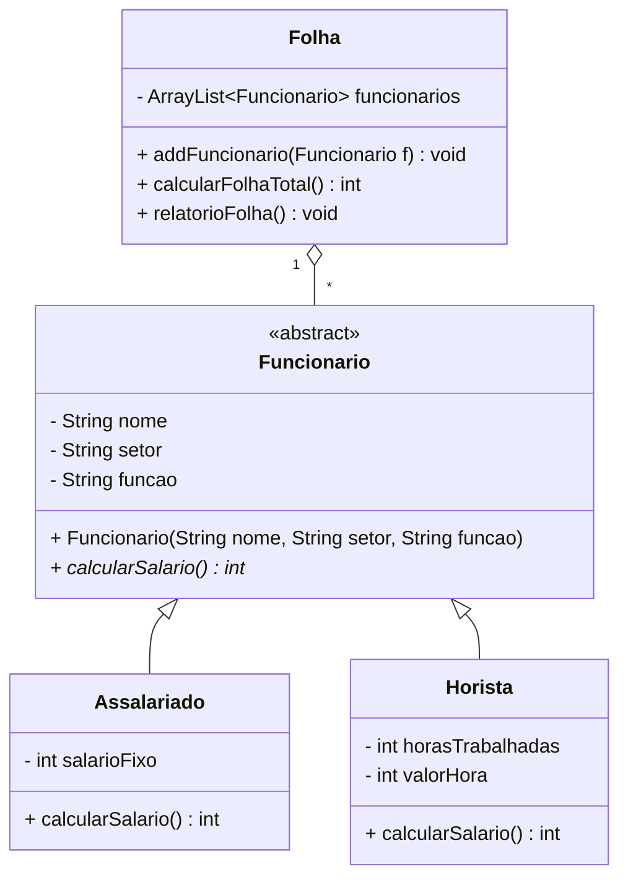

## Diagrama de Classes (UML)

```mermaid
classDiagram
    class Funcionario {
        <<abstract>>
        - String nome
        - String setor
        - String funcao
        + Funcionario(String nome, String setor, String funcao)
        + calcularSalario()* int
    }
    class Assalariado {
        - int salarioFixo
        + calcularSalario() int
    }
    class Horista {
        - int horasTrabalhadas
        - int valorHora
        + calcularSalario() int
    }
    class Folha {
        - ArrayList~Funcionario~ funcionarios
        + addFuncionario(Funcionario f) void
        + calcularFolhaTotal() int
        + relatorioFolha() void
    }
    Funcionario <|-- Assalariado
    Funcionario <|-- Horista
    Folha "1" o-- "*" Funcionario
```
